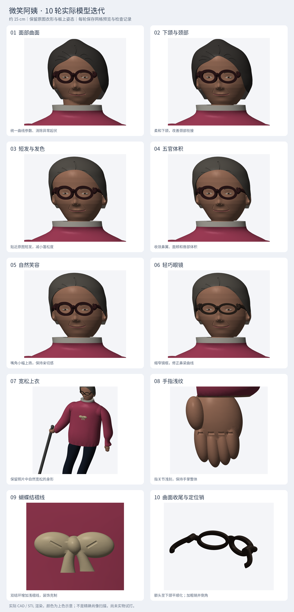

# 微笑阿姨 · 10 轮迭代记录

已完成 10 轮。在约 150 mm 总高内保留原图的粉色宽松上衣、深色长裤、黑鞋、握杆与板上姿态。喜剧感来自轻轻上扬的嘴角、椭圆眼镜和胸口小蝴蝶结，身体与头部比例保持克制。

每一轮均执行 FreeCAD 实体检查、STL 封闭性/面朝向/正体积/单连通检查和装配体积干涉检查。每轮为 16 个装配分件、2 个配合测试件，检查通过后才进入下一轮。预览均来自当轮实际导出的 STL。

| 轮次 | 修改 | 预览 | 检查记录 |
|---|---|---|---|
| 01 | 面部曲面连续性与细节采样 | [查看](iterations/01/face.png) | [18 件通过，干涉 0](iterations/01/report.json) |
| 02 | 柔和下颌与自然颈部过渡 | [查看](iterations/02/face.png) | [18 件通过，干涉 0](iterations/02/report.json) |
| 03 | 参考照片的贴头短发与灰棕发色 | [查看](iterations/03/face.png) | [18 件通过，干涉 0](iterations/03/report.json) |
| 04 | 收敛鼻翼、面颊与唇部体积 | [查看](iterations/04/face.png) | [18 件通过，干涉 0](iterations/04/report.json) |
| 05 | 克制而亲切的笑容与眼神 | [查看](iterations/05/face.png) | [18 件通过，干涉 0](iterations/05/report.json) |
| 06 | 减轻镜框厚重感与鼻梁连接 | [查看](iterations/06/face.png) | [18 件通过，干涉 0](iterations/06/report.json) |
| 07 | 恢复原图宽松上衣的腰胸比例 | [查看](iterations/07/assembly.png) | [18 件通过，干涉 0](iterations/07/report.json) |
| 08 | 自然手指关节与掌部细节 | [查看](iterations/08/focus.png) | [18 件通过，干涉 0](iterations/08/report.json) |
| 09 | 蝴蝶结丝带褶线与装饰层次 | [查看](iterations/09/focus.png) | [18 件通过，干涉 0](iterations/09/report.json) |
| 10 | 面部曲面收尾、眼镜定位销强化与导入倒角 | [查看](iterations/10/focus.png) | [18 件通过，干涉 0](iterations/10/report.json) |

## 第 10 轮完成后的模型

- [FreeCAD 装配文件](Aunt_Figure_V4.FCStd)、[拆分文件](Aunt_Figure_Exploded.FCStd)、[STEP](Aunt_Figure_Assembly.step)。
- [离线交互预览](交互预览.html)：可旋转、查看背面、逐件隐藏和拆分。
- [打印与装配说明](打印与装配说明.md)、[装配连接图](装配与连接图.pdf)。
- 镜框宽约 0.70 mm，定位销名义直径 1.42 mm、长度 2.33 mm，销端倒角约 0.15 mm；新增小销试配孔。
- 配合名义径向余量 0.20 mm；人物轴线相对板面法线约 8°，相对中央板面约 82°。

## 保留记录与限制

`iterations/01` 至 `10` 保留当轮预览、主要生成代码、参数和零件网格指纹；最终可打印 STL 在 `print_stl/`。每轮记录不是一套独立的原生 CAD 备份，原生模型与打印文件对应第 10 轮最终版。

第 6 轮初次检查发现眼镜鼻梁曲线处的微小网格重叠，修正连接曲线并重新导出后通过检查；失败结果没有作为已完成轮次。

图中发色、眼睛、嘴唇、衣服与刻槽颜色为上色建议，STL 不携带颜色。单张模糊照片的精确五官与背面无法直接恢复，模型保留适度的艺术化补全。未进行真实切片、打印或实物装配，先打印大小接头测试件。
